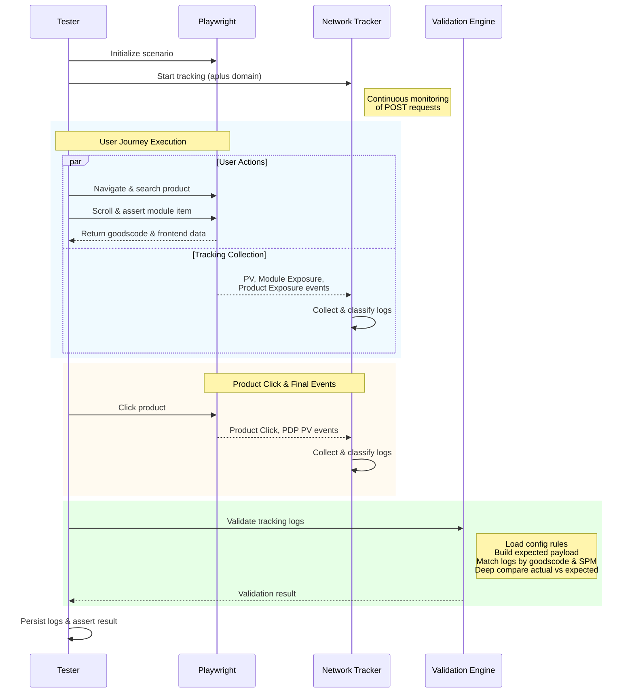

# 프로젝트 Flow - Sequence Diagram

## 주요 컴포넌트 설명

### 1. Pytest Runner (Tester)
- 테스트 케이스 실행 및 흐름 제어
- 페이지 오브젝트 모델(POM) 초기화
- 검증 결과 처리 및 어설션

### 2. Playwright (Browser)
- 브라우저 자동화 및 페이지 조작
- DOM 요소에서 데이터 추출
- 사용자 액션 시뮬레이션 (검색, 클릭, 스크롤)

### 3. Network Tracker (NT)
- `aplus.gmarket.co.kr` 도메인의 POST 요청 실시간 추적
- 요청 URL 및 페이로드 분석을 통한 로그 타입 분류
  - PV, PDP PV, Module Exposure, Product Exposure, Product Click, Product A2C Click
- goodscode 및 SPM 기반 로그 필터링

### 4. Gmarket Web UI
- 실제 웹 페이지 렌더링
- 사용자 액션에 따른 트래킹 이벤트 발생
- DOM을 통한 상품 정보 노출

### 5. Module Config
- `config/module_config.json` 파일에서 모듈별 설정 로드
- 예상값 정의 (SPM, channel_code, expected params 등)

### 6. Validation Helper (VAL)
- 모듈 설정과 프론트엔드 데이터를 결합하여 예상값 생성
- 플레이스홀더 치환 (`<상품번호>`, `<원가>`, `<할인가>`, `<쿠폰적용가>`, `<검색어>`)
- 실제 트래킹 로그와 예상값 비교
- 검증 결과 반환 (성공/실패, 에러 목록)

## 주요 흐름 단계

1. **초기화 단계**: 페이지 객체 생성 및 네트워크 트래킹 시작
2. **사용자 액션 단계**: 검색, 모듈 탐색, 상품 확인
3. **데이터 수집 단계**: DOM에서 가격 정보 추출 및 모듈 설정 로드
4. **트래킹 로그 수집**: 사용자 액션에 따른 트래킹 이벤트 수집 및 분류
5. **정합성 검증 단계**: 예상값과 실제 로그 비교
6. **결과 저장 단계**: 필터링된 로그를 JSON 파일로 저장

